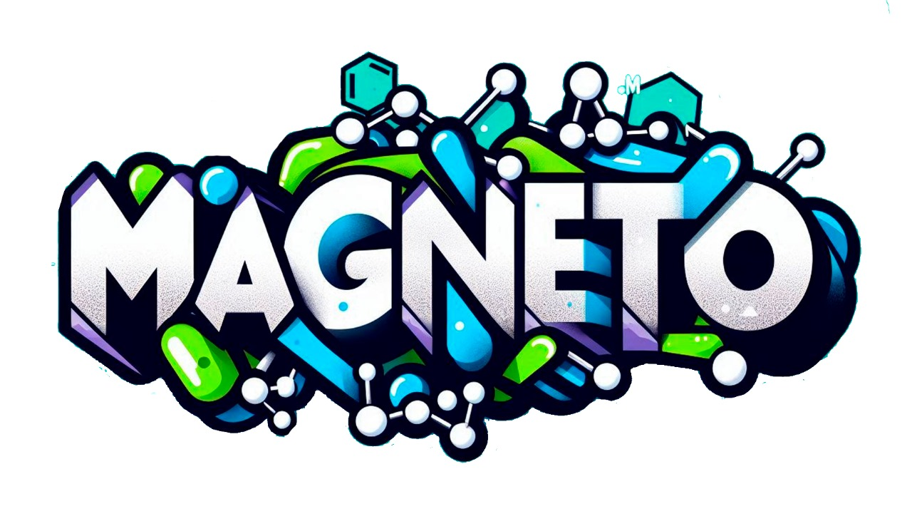
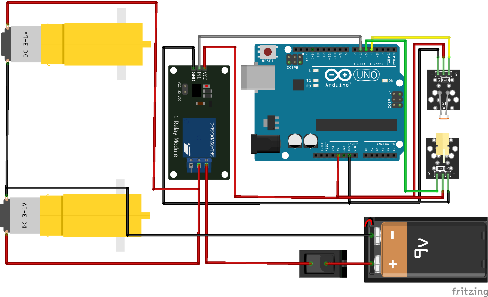

# What's Chem-E-car 🚗

Chem-E-Car is a competition that require to design and create a prototype of a car propelled and braked by chemical energy.

# What's included

Within src you will find the main Arduino code of 2024 competition in Peru - Qusco by Universidad Nacional Med - team.

# Electronic components 📄
 - Arduino Uno
 - Laser sensor KY-008
 - LDR sensor KY-018
 - Single channel relay
 - DC motor x2
 - 9V Battery
 - Switch

# Diagram ✏️

There are three observations: 
1. Relay is connect as normally open.
2. The 9V battery represent the chemical battery.
3. Arduino Uno is supplied energy by a external 9V battery.

